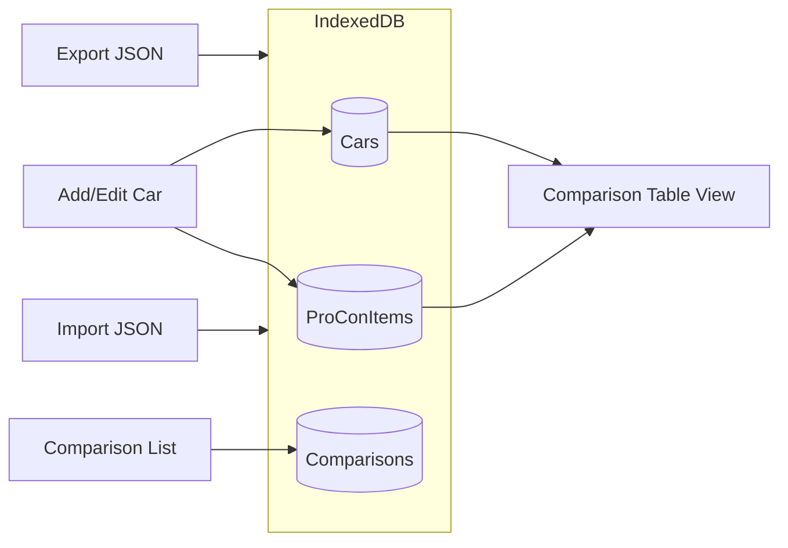
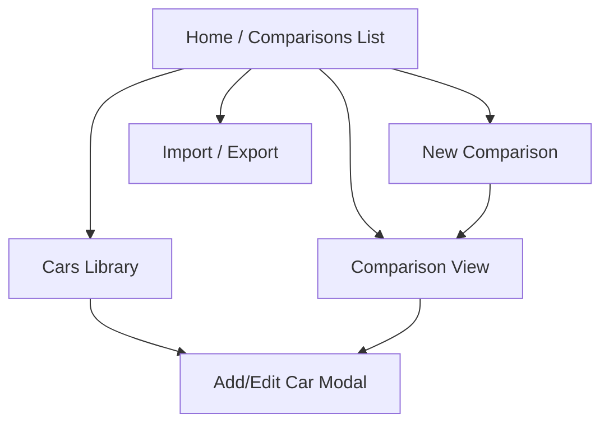

---

name: Car Comparison App
overview: Build a desktop-first car comparison web app using React + TypeScript + IndexedDB for local persistence and JSON export/import. v1 covers cars, comparisons, color-coded numeric specs, and reusable weighted pro/con items. Phase 2 adds photos. Phase 3 adds an AI-generated comparison summary.
todos:

- id: scaffold
content: Scaffold Vite + React + TS project with Tailwind, React Router, Dexie
status: in_progress
- id: data-model
content: Define Car/Comparison/ProCon types and Dexie schema with CRUD helpers
status: pending
- id: car-crud
content: Build CarForm and Cars library (specs + pro/con typeahead with weight)
status: pending
- id: comparison-crud
content: Build comparison list, create/rename/delete, car picker with reorder
status: pending
- id: comparison-table
content: Build color-coded ComparisonTable (numeric rows + pro/con rows + weighted score)
status: pending
- id: import-export
content: Implement JSON export/import incl. proConItems catalog merge
status: pending
- id: polish
content: Empty states, confirm dialogs, ranking + proCon scoring unit tests, desktop polish
status: pending
- id: phase2-photos
content: "Phase 2: Car photo uploads stored in IndexedDB, shown in comparison view"
status: pending
- id: phase2-catalog-mgmt
content: "Phase 2: Dedicated pro/con catalog management page in Settings"
status: pending
- id: phase3-ai-summary
content: "Phase 3: AI-generated comparison summary with best-choice recommendation"
status: pending
isProject: false

---


# Car Comparison App — Implementation Plan


## Recommended Stack

**Vite + React + TypeScript + Dexie.js (IndexedDB) + Tailwind CSS**


| Choice               | Why                                                                                                                         |
| -------------------- | --------------------------------------------------------------------------------------------------------------------------- |
| Web app (not native) | You have Node.js v24 already; no Rust (.NET/Tauri) or .NET (WPF) toolchain installed. Fastest path to a working desktop UI. |
| IndexedDB via Dexie  | Structured local persistence, no server, survives browser restarts.                                                         |
| JSON export/import   | Matches your "local + export" requirement; easy backup and sharing.                                                         |
| Desktop-first layout | Fixed min-width (~1200px), side nav, wide comparison table — no mobile breakpoints needed for v1.                           |


**Project location:** `C:\Users\mrkil\Projects\car-comparison` (create via `create_project` MCP when implementation starts).

---


## Core Concepts




- **Car** — a reusable entry in your library (e.g. "2024 Toyota Camry LE").
- **Comparison** — a named group (e.g. "Family SUVs") that references 2+ cars.
- **ProConItem** — a reusable pro/con label with a global weight; assigned to cars as pro or con.
- Cars can appear in multiple comparisons.

---


## Scope Decision: Pros & Cons in v1

**Recommendation: include pro/cons in v1.** It is reasonable and preferable to deferring them.


| Factor     | v1                                                                                       | Phase 2                                                                      |
| ---------- | ---------------------------------------------------------------------------------------- | ---------------------------------------------------------------------------- |
| Complexity | Low — no Blobs, no external APIs; reuses color palette + Dexie patterns                  | Same work, but retrofits an already-shipped comparison table                 |
| User value | Core to how you compare cars — a comparison without qualitative factors feels incomplete | Photos and AI benefit more from a complete comparison model already in place |
| Time cost  | +3–4 hours (~11–14 hr total v1)                                                          | Saves a second pass on CarForm, ComparisonTable, and import/export           |
| Risk       | Typeahead/combobox is the main new UI piece; well-scoped                                 | Schema migration if v1 ships without proCons fields                          |


**What stays in Phase 2:** photo uploads, dedicated catalog management page (bulk edit/delete unused items), Electron packaging optional in Phase 4.

**What stays in Phase 3:** AI summary — works better once pro/cons and weighted scores exist in v1.

---


## Data Model


### Car

```typescript
type FuelType = "gas" | "hybrid" | "electric";
type BodyStyle =
  | "sedan"
  | "suv"
  | "crossover"   // displayed as "Crossover / CUV"
  | "truck"
  | "coupe"
  | "hatchback"
  | "wagon"
  | "van"
  | "other";

type CargoCapacity = {
  seatsUpCuFt?: number;      // cargo volume with rear seats up
  seatsFoldedCuFt?: number;  // cargo volume with rear seats folded
};

type Price =
  | { mode: "static"; amount: number }
  | { mode: "range"; min: number; max: number };

type MpgStats = {
  city?: number;
  highway?: number;
  combined?: number;
};

interface Car {
  id: string;
  year: number;
  make: string;
  model: string;
  price: Price;
  mpg?: MpgStats;       // gas / hybrid
  mpge?: MpgStats;      // optional; shown when fuelType is hybrid or electric
  cargo?: CargoCapacity;
  bodyStyle: BodyStyle;
  fuelType: FuelType;
  notes?: string;
  proCons?: CarProConAssignment[];
  createdAt: string;
  updatedAt: string;
}
```


### ProConItem (catalog)

Reusable pro/con labels — created on first use, shared across all cars.

```typescript
interface ProConItem {
  id: string;
  label: string;       // e.g. "Wireless CarPlay", "Small third row"
  weight: number;      // 1–10 importance; lives on the catalog item globally
  createdAt: string;
  updatedAt: string;
}

type ProConPolarity = "pro" | "con";

interface CarProConAssignment {
  itemId: string;      // references ProConItem.id
  polarity: ProConPolarity;
}
```


### Comparison

```typescript
interface Comparison {
  id: string;
  name: string;
  carIds: string[];     // ordered columns in the table
  createdAt: string;
  updatedAt: string;
}
```


### Comparison rules (defaults)


| Field                                    | Better direction | Notes                                                                                          |
| ---------------------------------------- | ---------------- | ---------------------------------------------------------------------------------------------- |
| Price                                    | Lower            | Range uses **midpoint** `(min + max) / 2` for ranking; display still shows `$28,000 – $32,000` |
| MPG city/highway/combined                | Higher           | Use `mpg` for gas; for hybrid/electric prefer `mpge` when present, else `mpg`                  |
| Cargo (seats up)                         | Higher           | Units: cubic feet (cu ft)                                                                      |
| Cargo (seats folded)                     | Higher           | Separate row; higher is better                                                                 |
| Pro/con item rows                        | Polarity         | Green = pro, red = con, neutral = not assigned                                                 |
| Pro/con weighted score                   | Higher           | `Σ(pro weights) − Σ(con weights)` per car                                                      |
| Year, make, model, body style, fuel type | Neutral          | No green/red coloring                                                                          |


**Missing values:** show "—" and use neutral (gray) background — do not penalize incomplete rows.

**Ties:** if two cars share the best (or worst) value, both get green (or red).

---


## Color-Coding Algorithm

Pure function — easy to unit test:

```typescript
type RankColor = "best" | "mid" | "worst" | "neutral";

function rankColor(
  values: (number | null)[],
  index: number,
  direction: "lower" | "higher"
): RankColor {
  const present = values.filter((v): v is number => v != null);
  if (present.length < 2 || values[index] == null) return "neutral";

  const min = Math.min(...present);
  const max = Math.max(...present);
  if (min === max) return "neutral";

  const v = values[index]!;
  const isBest  = direction === "lower" ? v === min : v === max;
  const isWorst = direction === "lower" ? v === max : v === min;

  if (isBest)  return "best";
  if (isWorst) return "worst";
  return "mid";
}
```

CSS mapping: `best` → green tint, `worst` → red tint, `mid` → amber/neutral, `neutral` → default.

---


## App Screens & UX




### 1. Comparisons List (home)

- List saved comparisons with name, car count, last updated.
- Actions: Open, Rename, Delete, **New Comparison**.


### 2. Cars Library

- Searchable table of all cars (year/make/model, price, fuel type).
- Add / Edit / Delete car.
- Deleting a car removes it from any comparisons that reference it.


### 3. New / Edit Comparison

- Name the comparison.
- Pick cars from library (multi-select or drag-to-reorder).
- Minimum 2 cars to enable the comparison view.


### 4. Comparison View (main feature)

- **Rows** = attributes; **columns** = cars.
- Sticky header row with car names; sticky first column with attribute labels.
- Color-coded cells for price, MPG/MPGe, cargo.
- Horizontal scroll when many cars are added.

Example layout:


| Attribute                    | 2024 Camry | 2024 Model 3 | 2024 RAV4 Hybrid |
| ---------------------------- | ---------- | ------------ | ---------------- |
| Price                        | $28,000    | $38,000      | $32,500          |
| MPG Combined                 | 32         | —            | 40               |
| MPGe Combined                | —          | 132          | 94               |
| Cargo — seats up (cu ft)     | 15.1       | 19.8         | 37.6             |
| Cargo — seats folded (cu ft) | —          | —            | 69.8             |
| Wireless CarPlay ★8          | ✓ Pro      | ✓ Con        | —                |
| Pro/Con Score                | 16         | −8           | 0                |


### 5. Import / Export

- **Export:** download `car-comparison-backup.json` containing all cars + comparisons.
- **Import:** file picker; merge by `id` (update existing, add new) with a confirmation summary before applying.

---


## Project Structure

```
car-comparison/
├── src/
│   ├── components/
│   │   ├── CarForm.tsx          # add/edit car fields
│   │   ├── ComparisonTable.tsx  # color-coded grid
│   │   ├── CarPicker.tsx        # select cars for a comparison
│   │   └── Layout.tsx           # sidebar + main area
│   ├── db/
│   │   └── index.ts             # Dexie schema + CRUD helpers
│   ├── lib/
│   │   ├── ranking.ts           # rankColor + price midpoint helpers
│   │   ├── proConScoring.ts     # polarity colors + weighted score
│   │   ├── format.ts            # currency, MPG display
│   │   └── importExport.ts      # JSON serialize/deserialize
│   │   # Phase 2+: photoStorage.ts
│   │   # Phase 3+: ai/ (provider adapters, prompt templates)
│   ├── pages/
│   │   ├── ComparisonsPage.tsx
│   │   ├── CarsPage.tsx
│   │   ├── ComparisonDetailPage.tsx
│   │   └── SettingsPage.tsx
│   ├── types/
│   │   └── index.ts
│   ├── App.tsx
│   └── main.tsx
├── package.json
└── vite.config.ts
```

Routing: [React Router](https://reactrouter.com/) with routes `/`, `/cars`, `/comparisons/:id`, `/settings`.

---


## Implementation Steps (v1)


### Step 1 — Scaffold (≈30 min)

- `npm create vite@latest car-comparison -- --template react-ts`
- Add Tailwind, React Router, Dexie, UUID (`crypto.randomUUID()`)
- Desktop layout shell (sidebar nav, min-width container)


### Step 2 — Data layer (≈1.5 hr)

- Define TypeScript types in `[src/types/index.ts](src/types/index.ts)`
- Dexie schema: `cars`, `comparisons`, and `proConItems` tables
- CRUD helpers for all three; auto-save on every mutation


### Step 3 — Car management (≈2–3 hr)

- Car form with validation for all spec fields (price static/range, MPG/MPGe, cargo seats up/folded, Crossover/CUV body style)
- **Pro/con sections:** typeahead combobox per pro and con list
  - Typing a new label creates a `ProConItem` (default weight 5)
  - Selecting an existing item reuses it from the catalog
  - Inline weight slider (1–10) on each item
- Cars library page with edit/delete


### Step 4 — Comparison management (≈1 hr)

- Create/rename/delete comparisons; car picker with reorder
- Minimum 2 cars to enable comparison view


### Step 5 — Comparison table + colors (≈3 hr)

- Numeric rows: price, MPG/MPGe, cargo (seats up / folded) with `rankColor`
- **Pro/con rows:** one row per catalog item relevant to any car in the comparison (sorted by weight desc)
  - Polarity coloring: pro → green, con → red, absent → neutral
- **Weighted score row:** `Σ(pro weights) − Σ(con weights)`, ranked with `rankColor`


### Step 6 — Import / Export (≈1 hr)

- Export/import cars, comparisons, and `proConItems` catalog
- Merge by `id`; confirmation dialog before apply


### Step 7 — Polish (≈1 hr)

- Empty states, confirm dialogs, keyboard-friendly forms
- Unit tests for `ranking.ts` and `proConScoring.ts`

**Total estimate:** ~11–14 hours for v1 (was ~8–10 without pro/cons).

---


## Key Dependencies

```json
{
  "dependencies": {
    "react": "^19",
    "react-dom": "^19",
    "react-router-dom": "^7",
    "dexie": "^4",
    "dexie-react-hooks": "^1"
  },
  "devDependencies": {
    "tailwindcss": "^4",
    "@tailwindcss/vite": "^4",
    "typescript": "^5",
    "vite": "^6",
    "vitest": "^3"
  }
}
```

---


## Out of Scope for v1

- Mobile/responsive layout
- Cloud sync / user accounts
- Auto-fetching car specs from external APIs (manual entry only)
- Photo uploads, AI summary (see Phases 2–3 below)
- Dedicated pro/con catalog management page (v1 includes inline create/reuse/weight in car form)
- Electron `.exe` packaging (see Phase 4 optional add-on below)

---


## Phase 2 — Enhanced Features (post-v1)


### 2a. Photo Uploads

Store photos per car in IndexedDB as Blobs (Dexie supports Blob storage natively).

```typescript
interface CarPhoto {
  id: string;
  blob: Blob;
  mimeType: string;
  caption?: string;
  sortOrder: number;
}

// Add to Car:
photos?: CarPhoto[];
```

- Car form: multi-image upload (drag-and-drop or file picker), reorder, delete, optional caption.
- Comparison view: thumbnail row under each car column header; click to expand lightbox.
- Export/import: photos serialized as base64 in the backup JSON (acceptable for personal use; warn if backup exceeds ~50 MB).
- Practical limit: cap at ~5 photos per car to keep IndexedDB performant.


### 2b. Pro/Con Catalog Management (optional polish)

v1 covers create/reuse/weight inline in the car form. Phase 2 adds a Settings subsection to:

- List all catalog items with usage count (how many cars reference each)
- Bulk edit labels and weights
- Delete unused items safely

**Phase 2 estimate:** ~4–6 hours additional.

---


## Phase 3 — AI Comparison Summary

Generate a natural-language summary of a comparison, highlighting trade-offs and suggesting a best choice based on entered specs and weighted pros/cons.

### Approach

- **Provider-agnostic:** Settings page for API key + provider choice (OpenAI as default; architecture allows adding Anthropic/Ollama later).
- **User-initiated:** "Generate Summary" button on the comparison detail page — no automatic calls.
- **Structured prompt:** Send a JSON snapshot of the comparison (car specs, color rankings, pro/con assignments with weights, weighted pro/con scores) to the LLM; request a concise markdown response with sections: Overview, Standout strengths per car, Key trade-offs, Recommended choice (with caveats).
- **Cached result:** Store last summary on the `Comparison` record with a `generatedAt` timestamp; show stale indicator if underlying data changed since generation.
- **Privacy:** Clear disclaimer that data is sent to the chosen API; API key stored locally in IndexedDB/settings only.

```typescript
// Add to Comparison:
aiSummary?: {
  text: string;           // markdown
  generatedAt: string;
  provider: string;
  model: string;
};
```


### Settings

```typescript
interface AiSettings {
  provider: "openai" | "anthropic" | "ollama";
  apiKey?: string;        // encrypted-at-rest optional nice-to-have; plain localStorage acceptable for personal app
  model?: string;         // e.g. "gpt-4o-mini"
}
```


### UI

- Summary panel above or beside the comparison table (collapsible).
- Loading state + error handling (invalid key, rate limit, network).
- "Regenerate" button; copy-to-clipboard for the summary text.
- If no API key configured, show setup prompt linking to Settings.


### Implementation notes

- Use a thin `src/lib/ai/` module with provider adapters sharing a common `generateComparisonSummary(comparison, cars, proConItems)` interface.
- Keep prompts in a dedicated template file for easy tuning.
- Do **not** let the AI modify stored data — read-only advisory output.

**Phase 3 estimate:** ~6–8 hours additional.

---


## Phase 4 (Optional) — Standalone Windows App

If you want a double-clickable app instead of opening a browser tab:

1. Add Electron (`electron` + `electron-builder`)
2. Point the Electron window at the Vite build output
3. Build with `electron-builder --win` → produces an installer/`.exe`

No Rust install required. Adds ~150 MB bundle size vs ~0 for browser-only. Independent of Phase 2–3 feature work.

---


## Success Criteria


### v1

- Create cars with all spec fields (price static/range, MPG/MPGe, cargo seats up/folded, Crossover/CUV, fuel type)
- Type pros/cons that become reusable catalog items with global weight (1–10); assign as pro or con per car
- Group cars into named comparisons
- Side-by-side table with color-coded numeric rows and pro/con rows (green/red/neutral) plus weighted pro/con score
- Data persists locally; export/import includes catalog + assignments


### Phase 2

- Upload, reorder, and delete photos per car; visible in comparison view
- Optional catalog management page for bulk edit/delete of pro/con items


### Phase 3

- Configure AI provider and API key in Settings
- Generate a markdown summary for any comparison highlighting trade-offs and a recommended best choice
- Cache summary on the comparison; indicate when stale after data changes

